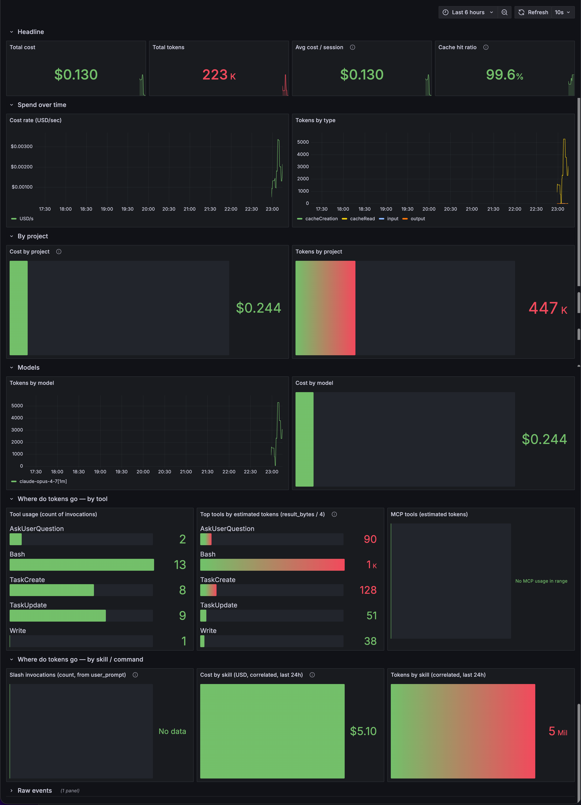

# claudescope

A scope for your Claude Code sessions. Self-hosted observability stack that turns Claude Code's OpenTelemetry signals into real-time dashboards: tokens, cost, tools, skills, and per-project breakdowns.



```
Claude Code ──OTLP/gRPC──▶ OTEL Collector ──▶ Prometheus (metrics)
                                          └─▶ Loki        (events/logs)
                                                              │
                                                              ▼
                                                          Grafana
                                                              ▲
                                          correlator ─────────┘
                                  (Python sidecar that attributes
                                   tokens/cost back to /<skill>)
```

## Quickstart

```bash
git clone https://github.com/halan/claudescope.git
cd claudescope
./install.sh   # creates ./claudescope/, patches ~/.claude/settings.json, starts the stack
```

Or, if you already cloned and want to run from the checkout:

```bash
docker compose up -d
```

Then **restart Claude Code** so it picks up the new env vars in `~/.claude/settings.json`. After your next turn:

- **Grafana**: <http://localhost:3000> (admin/admin, or anonymous Viewer)
- **Prometheus**: <http://localhost:9090>
- **Loki**: <http://localhost:3100>
- **OTLP collector**: `localhost:4317` (gRPC) and `:4318` (HTTP)

The "Claude Code — Overview" dashboard is auto-provisioned under the "Claude Code" folder.

## What you get

The provisioned dashboard answers:
- **How much am I spending?** — total cost, cost rate over time, cost by model.
- **Where are my tokens going?** — by tool, by MCP, by skill (real attribution via the correlator), by project (via the shell wrapper).
- **Am I using cache well?** — cache hit ratio with color thresholds.
- **What did I just do?** — raw event log (collapsed by default).

## Privacy & security

This stack runs entirely on your machine — nothing leaves localhost. That said:

- **`OTEL_LOG_USER_PROMPTS=1` is enabled by default.** That means the **full text of every prompt you type into Claude Code** lands in Loki and is queryable in Grafana. Disable it (`"OTEL_LOG_USER_PROMPTS": "0"` in `~/.claude/settings.json`) if that's not what you want — the "Slash invocations" panel will stop working, but everything else still does.
- **Grafana ships with `admin/admin` and anonymous Viewer access.** Fine for `localhost`, dangerous if you expose port 3000 to a network. Change `GF_SECURITY_ADMIN_PASSWORD` in `docker-compose.yml` and drop `GF_AUTH_ANONYMOUS_ENABLED` before exposing publicly.
- **Loki accepts unauthenticated writes on port 3100.** Same caveat — keep it on `localhost` or front it with auth.

## Claude Code configuration

The install script merges these keys into `~/.claude/settings.json` (a timestamped backup is saved alongside):

```json
"env": {
  "CLAUDE_CODE_ENABLE_TELEMETRY": "1",
  "OTEL_METRICS_EXPORTER": "otlp",
  "OTEL_LOGS_EXPORTER": "otlp",
  "OTEL_EXPORTER_OTLP_PROTOCOL": "grpc",
  "OTEL_EXPORTER_OTLP_ENDPOINT": "http://localhost:4317",
  "OTEL_METRIC_EXPORT_INTERVAL": "10000",
  "OTEL_LOGS_EXPORT_INTERVAL": "5000",
  "OTEL_LOG_USER_PROMPTS": "1",
  "OTEL_RESOURCE_ATTRIBUTES": "service.name=claude-code,user.id=<you>"
}
```

**Restart Claude Code** after the stack is up. Env vars in `settings.json` are read at startup.

## Verify data is flowing

```bash
# Metrics reaching Prometheus
curl -s http://localhost:9090/api/v1/label/__name__/values | jq '.data[] | select(startswith("claude"))'

# Raw metrics from the collector exporter
curl -s http://localhost:8889/metrics | grep claude_code

# Logs in Loki
curl -s 'http://localhost:3100/loki/api/v1/query?query={service_name="claude-code"}' | jq
```

If nothing shows up:
- Claude Code must have completed **at least one turn** after starting with the new config.
- `OTEL_METRIC_EXPORT_INTERVAL=10000` means metrics are pushed every 10s.
- Check the collector: `docker logs claude-otel-collector`

## Key metrics (Prometheus)

| Metric | What it measures |
|---|---|
| `claude_code_token_usage_tokens_total` | Tokens consumed (label `type`=input/output/cacheRead/cacheCreation) |
| `claude_code_cost_usage_USD_total` | Cost in USD |
| `claude_code_api_request_duration_milliseconds` | Model call latency |
| `claude_code_code_edit_tool_decision_total` | Edit-tool accept/reject decisions (label `tool_name`, `decision`) |
| `claude_code_session_count_total` | Sessions started |
| `claude_code_lines_of_code_count_total` | Lines of code added/removed |
| `claude_code_commit_count_total` | Commits created |
| `claude_code_pull_request_count_total` | PRs created |
| `claude_code_skill_tokens{skill, type}` | **From the correlator** — tokens attributed to each `/<skill>` |
| `claude_code_skill_cost_usd{skill}` | **From the correlator** — USD attributed to each `/<skill>` |
| `claude_code_skill_turns{skill}` | **From the correlator** — number of api_request turns per skill |

Common labels: `model`, `session_id`, `user_id`, `tool_name`, `type`, `decision`, `project` (when the shell wrapper is in use).

## Events (Loki)

The OTLP→Loki exporter stores OTLP attributes as **structured metadata** (not stream labels). The only real stream label is `service_name`. Filter and aggregate on attributes using a parser stage (`| key="value"`).

Available structured-metadata fields on each event:
- `event_name` — e.g. `user_prompt`, `tool_result`, `api_request`, `api_error`, `skill_activated`, `tool_decision`
- `tool_name`, `skill_name`, `model`, `session_id`, `user_id`, `decision_type`

The log line itself is the prefixed event name (e.g. `claude_code.tool_result`).

### Useful LogQL queries

```logql
# Everything from Claude
{service_name="claude-code"}

# Skill usage broken down by skill name (telemetry side — anonymizes user-defined skills)
sum by (skill_name) (count_over_time({service_name="claude-code"} | event_name="skill_activated" [1h]))

# Tool usage broken down by tool
sum by (tool_name) (count_over_time({service_name="claude-code"} | event_name="tool_result" [1h]))

# API errors
{service_name="claude-code"} | event_name="api_error"

# Specific session
{service_name="claude-code"} | session_id="abc123"
```

### Useful PromQL queries

```promql
# Total tokens in the last 24h
sum(increase(claude_code_token_usage_tokens_total[24h]))

# Cost by model
sum by (model) (claude_code_cost_usage_USD_total)

# Cache hit ratio
sum(claude_code_token_usage_tokens_total{type="cacheRead"})
  / sum(claude_code_token_usage_tokens_total{type=~"cacheRead|cacheCreation|input"})

# Per-skill cost (requires correlator)
sum by (skill) (claude_code_skill_cost_usd)
```

## Heaviest tools / MCPs by output size (proxy for token cost)

`api_request` events don't carry `tool_name`, so cost can't be attributed directly to a tool. As a proxy use `tool_result_size_bytes`, the bytes that get fed back to the model on the next turn (≈ tokens × 3–4):

```logql
topk(10, sum by (tool_name) (
  sum_over_time({service_name="claude-code"} | event_name="tool_result" | unwrap tool_result_size_bytes [24h])
))

# MCP tools only
sum by (tool_name) (
  sum_over_time({service_name="claude-code"} | event_name="tool_result" | tool_name=~"mcp__.+" | unwrap tool_result_size_bytes [24h])
)
```

Caveats: doesn't account for cache hits; doesn't capture model output tokens the tool result *caused*; only the input contribution.

## Per-skill cost (correlator sidecar)

A small Python service in `correlator/` polls Loki every 30 seconds, walks each session's timeline, and attributes each `api_request`'s tokens and cost to whichever `/<skill>` the user most recently invoked in that session. Anything before the first slash invocation goes to the `__chat` bucket.

It exposes Prometheus metrics on port 9100:

- `claude_code_skill_tokens{skill, type}`
- `claude_code_skill_cost_usd{skill}`
- `claude_code_skill_turns{skill}`

Powers the "Cost by skill" and "Tokens by skill" panels. Knobs via env: `WINDOW_HOURS` (default 24), `INTERVAL_SECONDS` (default 30).

## Per-project cost (shell wrapper)

To break cost down by project folder, add a wrapper to your shell rc that sets `OTEL_RESOURCE_ATTRIBUTES` with a `project=<repo>` based on the current git root:

```zsh
# ~/.zshrc
claude() {
  local root
  root="$(git -C "$PWD" rev-parse --show-toplevel 2>/dev/null || echo "$PWD")"
  local project="${root:t}"
  OTEL_RESOURCE_ATTRIBUTES="service.name=claude-code,user.id=$USER,project=$project" \
    command claude "$@"
}
```

Open a new shell so the function takes effect. All metrics and events then carry a `project` label, used by the "Cost by project" / "Tokens by project" panels.

## What's not available

- **Auto-compaction count.** Claude Code does not emit a telemetry event when it compacts context. A `PreCompact` hook in `~/.claude/settings.json` that writes a log line is the only workaround.
- **True per-tool cost from metrics.** The metric `claude_code_cost_usage_USD_total` carries `model`/`session_id`/`user_id` but not `tool_name`. Use the byte-size proxy above or, for skills, the correlator.

## Retention

- **Prometheus**: 60 days (`--storage.tsdb.retention.time=60d` in `docker-compose.yml`).
- **Loki**: 60 days, enforced by the compactor (`limits_config.retention_period: 60d` in `loki-config.yaml`, with `compactor.retention_enabled: true`).

Reducing retention does not delete past data immediately — the compactor sweeps on its own schedule.

## Stop / clean

```bash
docker compose down          # stops containers, keeps data
docker compose down -v       # also removes volumes (wipes everything)
```

## Roadmap

Tracked as GitHub Issues, grouped by phase:

- [Phase 1 — Polish the Overview](https://github.com/halan/claudescope/issues?q=is%3Aissue+is%3Aopen+label%3Aphase-1)
- [Phase 2 — Secondary dashboards](https://github.com/halan/claudescope/issues?q=is%3Aissue+is%3Aopen+label%3Aphase-2)
- [Phase 3 — Correlator extensions](https://github.com/halan/claudescope/issues?q=is%3Aissue+is%3Aopen+label%3Aphase-3)
- [Phase 4 — Alerting](https://github.com/halan/claudescope/issues?q=is%3Aissue+is%3Aopen+label%3Aphase-4)

Operating rules (20-item cap, stale items expire at 60 days, etc.) are in the [pinned tracker issue](https://github.com/halan/claudescope/issues/18).

## License

MIT. See [LICENSE](LICENSE).
